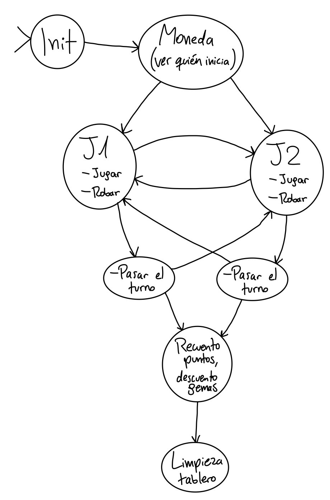

# Gwen't

This work is licensed under a
[Creative Commons Attribution 4.0 International License](http://creativecommons.org/licenses/by/4.0/)

Context
-------

This project's goal is to create a (simplified) clone of the
[_Gwent_](https://www.playgwent.com/en) card game developed by [_CD PROJEKT RED_](https://cdprojektred.com/en/)

---

**Este proyecto fue realizado durante el curso CC3002: Metodologías de Diseño y Programación en el semestre de Otoño (Marzo a Julio) del año 2023**
El código se encuentra inconcluso, y la última modificación fue registrada el día 19 de Julio de 2023.

# UML hasta la entrega final de la Tarea 2

# Diagrama de estados (preliminar)

Hasta el 24 de Abril, este código incluye la base para empezar a crear "Jugadores" y "Cartas", sin embargo, 
falta implementar más métodos que permitan el correcto funcionamiento de cada clase. Por ahora, es posible
crear jugadores y asignarles un mazo, pero aún falta por agregar más funciones que permitan operar
apropiadamente los objetos que representan los mazos (Deck) y manos de jugador (Hand).

Al 24 de Mayo:

-> Éste código fue modificado para que la clase "Player" pueda 'trabajar' directamente el mazo y la mano 
    que tiene asignados, por lo que las clases "Deck" y "Hand" fueron eliminadas del código. Con esto también se 
    busca agilizar y simplificar el uso de los diferentes métodos involucrados.

-> Los métodos definidos en las clases previamente mencionadas ahora están dentro de "Player". 

-> Ahora la clase abstracta "Card" es un trait del mismo nombre, y la clase "UnitCard" ahora es una clase 
    abstracta llamada "AbsUnitCard". 

-> Fueron añadidas 3 clases que definen los 3 tipos de carta de unidad: "CCombatCard", "RangedCard", y "SiegeCard".

-> Los argumentos que reciben los objetos de tipo "Card" fueron ligeramente modificados, tal que ahora solo
    es necesario asignarles su nombre, su efecto, y sus puntos (en los casos que aplique).

-> La clase "Player" ya no está dentro de un package, ahora está dentro del package "gwent" únicamente.

(W.I.P. 1) Progresivamente están siendo modificados los tests creados previamente, para que las clases puedan ser 
    testeadas (valga la redundancia) junto a sus métodos apropiadamente.

(W.I.P. 2) Se dió inicio a la implementación del tablero de juego, el cual sólo 'existe' en la clase de
    tests "TestBoard", dónde fueron descritos algunos casos que a futuro podrán ser verificados.

(W.I.P. 3) Se dió inicio a la implementación de los campos de juego (asociados a un jugador), los que formarán
    a futuro un tablero de juego completo junto a una zona climática. Actualmente, un campo de juego se denomina
    "Field" y se encuentra disponible en el package "gwent". Aún no tiene ningún método implementado, y está
    compuesto por listas inmutables.

Al 2 de Junio:

El código ha experimentado varios cambios tras la última edición:

-> Ahora es posible implementar correctamente un campo de juego, y es posible invocar distintos métodos
asociados a uno.

-> Ahora existe la clase "Board", la cual es utilizada para implementar el tablero del juego.

-> Se modificó la clase "CCombatCard", la cual ahora es llamada "CloseCombatCard".

-> Fueron eliminados los siguientes archivos de test: "TestUnitCards" y "TestWeatherCards".

-> Los tests preexistentes fueron modificados para que puedan ser utilizados apropiadamente mediante los 
    métodos correspondientes.

-> Fueron agregados algunos tests para verificar el correcto funcionamiento de los métodos de cada clase.

-> Todo el código está documentado, a excepción de métodos originales de Scala (como equals, canEqual, y 
    toString, que fueron sobreescritos en las clases de cartas).

Al 7 de Junio:

-> Correcciones menores en la clase TestPlayer para que los test puedan correr.

-> Implementación del método "removeCard" en la clase Player: ahora es posible eliminar cartas de la mano
    del jugador.

-> Ahora debería ser más sencillo leer este archivo.

-> Inclusión del UML y el diagrama de estados preliminar al archivo README.md

Al 19 de Julio:

-> Para evitar problemas en la implementación de algunos métodos, el código ya no utiliza con generics.

-> Fueron creadas las clases "GameController", "GameState", "EndPhase", "PCTurnState" y "PlayerTurnState" 
    para implementar el controlador del juego (las últimas 4 contenidas en el package "states").

-> Para simplificar el uso de las cartas de clima, la clase "Field" ahora cuenta con una cuarta variable
    llamada "WeatherCardSlot", la cual puede almacenar hasta 1 (una) carta de clima en cualquier momento.
    Además, fue implementado un cuarto método "placeCard" en ésta misma clase, el cual permite 'colocar'
    una carta de clima en el campo de juego de un jugador.
    Actualmente, el método "fieldIsEmpty" de la clase anterior no funciona como debería, pues no considera
    (todavía) si hay o no una carta de clima en el campo de juego del jugador, esto será arreglado en la
    siguiente entrega.

-> Fueron creadas las clases "AbstractSubject", "Observer" y "Subject" dentro del package "observer" para
    la realización de procesos no implementados (como ver si un jugador perdió todas sus gemas).
